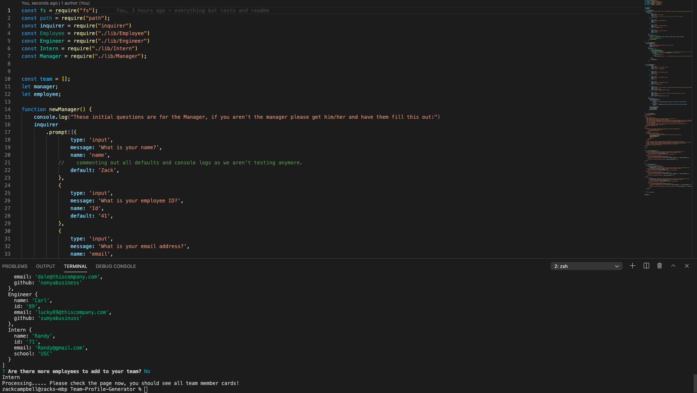
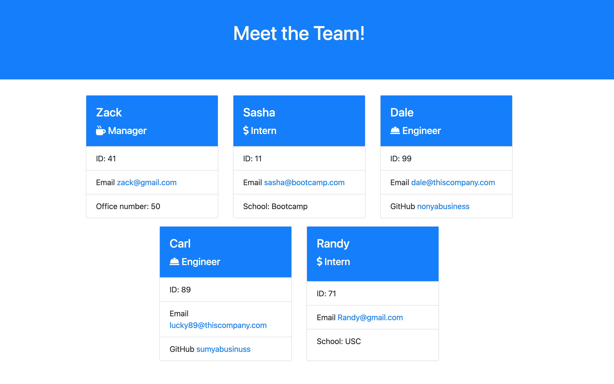

# Team Profile Generator
  -- Zack Campbell
  
  

  ## Description
  It's a project that uses Objected Oriented Programming (OOP) to create classes and subclasses of objects with inherited properties and methods. Specifically a class for employees and subclasses for Managers, Engineers, and Interns. Using node and npm Inquirer, the command line app asks the user for the employee's role and some key information. It then compiles that information and creates an HTML document with "cards" for each member of the team. There is no limit to the number of team members, but there must be one manager. **[CLICK HERE](https://drive.google.com/file/d/1zaeMvt-l2zsLtv9DiKFUjHZ3fIYZCazX/view?usp=sharing)** for a walkthrough of the app.

  
  ## Table of Contents 
  - [Installation](#installation)
  - [Usage](#usage)
  - [Credits](#credits)
  - [License](#license)
  - [Contributing](#contributing)
  - [Tests](#tests)
  
  Here are some Screenshots:
  
  
  ## Installation
  All the required packages are listed as dependancies. Run npm i to install all dependancies to use inquirer and jest (if you want to try out the unit tests.)
  ## Usage
  Feel free to add on or improve. I will look at any pull requests.
  ## Credits
  None.
  ## License
 The MIT License

  ---
  
  ## Contributing
  Feel free to add on or improve. I will look at any pull requests.
  ## Tests
  The tests are only for initialization of each class and subclass, but run npm install on jest and run npm test to try out the unit tests.
